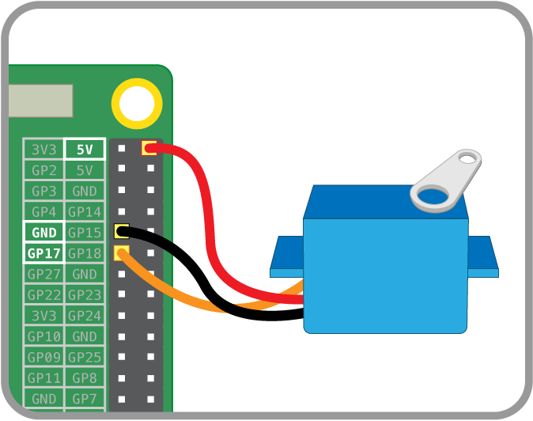

## Using a servo


Servos are small motors with embedded control circuitry that can turn up to 180 degrees.

You control the servo by turning one of the GPIO pins on and off at an incredibly fast rate. The length of the pulses (also known as pulse width) is what controls which direction the servo is pointing in.

These signals are called PWM (Pulse Width Modulation) and allow you to do all manner of things, from dimming LEDs to driving motors slower than normal.

The Raspberry Pi does not support generating these PWM signals as standard, as it does not have a dedicated clock system to do it. For this project we are using software-generated PWM signals. The drawback of this, though, is the signals won't be perfect, so the servo may jiggle back and forth a bit.

### Wiring up your servo

Servos have three leads coming from them. Normally, the brown/black one is ground, the red is 5v (for hobby servos), and yellow/orange is the signal. We will use male to female jumper wires in order to connect the female pins of the servo to the Pi's GPIO pins. First connect the brown/black wire of your servo to pin 9 of the Pi. Then attach the red wire of your servo to pin 2 - the 5v pin of the Pi. Finally, connect the control wire of the servo (yellow/orange) to pin 11 on the Pi. Here's a circuit diagram:



### Using a servo with RPi.GPIO

We will be using a servo for the latch that holds the panel closed.

RPi.GPIO allows for really easy software PWM to be added to your Python programs.

``` python
# Set up libraries and overall settings
import RPi.GPIO as GPIO  # Imports the standard Raspberry Pi GPIO library
from time import sleep   # Imports sleep (aka wait or pause) into the program
GPIO.setmode(GPIO.BOARD) # Sets the pin numbering system to use the physical layout

# Set up pin 11 for PWM
GPIO.setup(11,GPIO.OUT)  # Sets up pin 11 to an output (instead of an input)
p = GPIO.PWM(11, 50)     # Sets up pin 11 as a PWM pin
p.start(0)               # Starts running PWM on the pin and sets it to 0

# Move the servo back and forth
p.ChangeDutyCycle(3)     # Changes the pulse width to 3 (so moves the servo)
sleep(1)                 # Wait 1 second
p.ChangeDutyCycle(12)    # Changes the pulse width to 12 (so moves the servo)
sleep(1)

# Clean up everything
p.stop()                 # At the end of the program, stop the PWM
GPIO.cleanup()           # Resets the GPIO pins back to defaults
```

