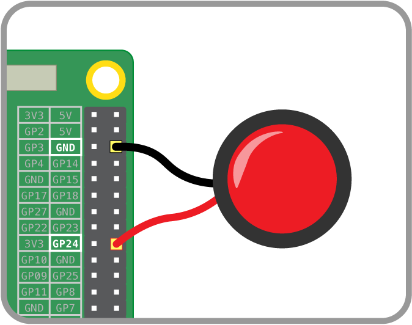

## Wiring up the button

In order for your grandpa scarer to be activated you will need to hook up a button of some kind, preferably with a long wire attached to it so that you can be far, far away when you scare someone. Here is the button that we used:


Buttons work on this concept - you have two wires, one connected to ground and the other connected to a GPIO pin (we had an additional wire to try out the LED in the button which didn't work). When you press the button, the circuit completes and the GPIO pin sees ground. You would think that is all that is needed but if we leave it here, we may get left with a "floating input". A floating input occurs when the GPIO pin is connected to nothing; in other words, when the button is not being pressed it is connected to nothing. The issue with this is the GPIO pin value will float back and forth between a 0 and 1 randomly.

### Pull up resistors

To fix this issue, we use the Raspberry Pi's clever little built in pull up resistors. These work by connecting the GPIO pin to 3.3v via a very large resistance resistor (usually 10k!). This is a difficult path for the current to take, so it only takes it as a last resort. If the button isn't pushed this is the only option so the GPIO pin sees 3.3v; but if the button is pressed, it sees ground which is much easier to get to as it has no massive resistor. We could quite easily build this circuit on a breadboard ourselves but the Raspberry Pi has it built-in on every GPIO pin, so why create more work for ourselves?

### Wiring it up

Now that you understand the basic principles behind the button's operation, let's wire it up. First off, you should have two wires connected to two of the pins on your button. The one we used had two clearly marked pins for this, however it is not uncommon for buttons (especially the breadboard variety) to have four legs; these are just two sets of two, so make sure that you only wire up one set. TIP: Colour code them. Our wires were around six metres long for a maximum scaring distance!

Now that you have two wires connected to your button, you will now need to wire it up to your Raspberry Pi. Firstly, we are going to connect one of the wires to ground: with buttons it doesn't matter which one of the wires you use! As we will be connecting to the Pi's male GPIO pins and the wire from your button will most likely be male as well, it is advisable to use a female to female jumper wire in between the two to make wiring a little bit easier. Without further ado, connect a wire from your button to pin 6 of the Pi (ground). Here is a diagram:


Next we need to connect the other wire from the button; this is going straight to one of the Pi's input pins in order for us to be able to read it. Again, using female to female jumper wires, connect the remaining wire from your button to pin 18 on the Pi like so:



And that is it! Your button is now all wired up. If you have a mess of long cables now going to the button, it may be an idea to put one end of each into a hand drill and have a friend hold the other end. Then spin the drill to wind the cables together. You may need to use tape to help stop it unwinding.

Now let's have a look at the code that we need to read the input of a button:

```python
import RPi.GPIO as GPIO
import time

# Sets the Pi so it knows we are using the physical pin numbering
GPIO.setmode(GPIO.BOARD)

# Sets up pin 18 as an input
GPIO.setup(18, GPIO.IN, GPIO.PUD_UP)

# Detects the button being pressed
def waitButton():
    GPIO.wait_for_edge(18, GPIO.RISING)
    print('Button pressed!')

# Runs function
waitbutton()
```

