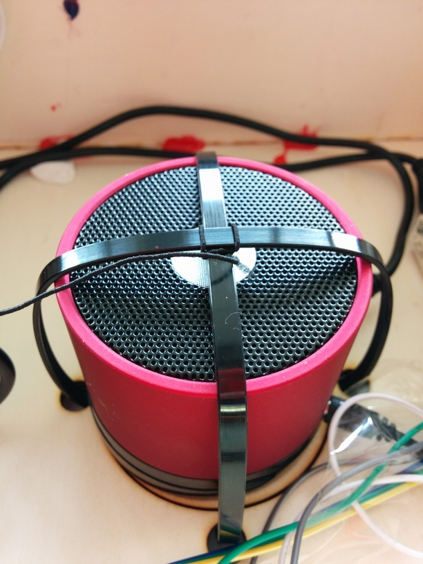
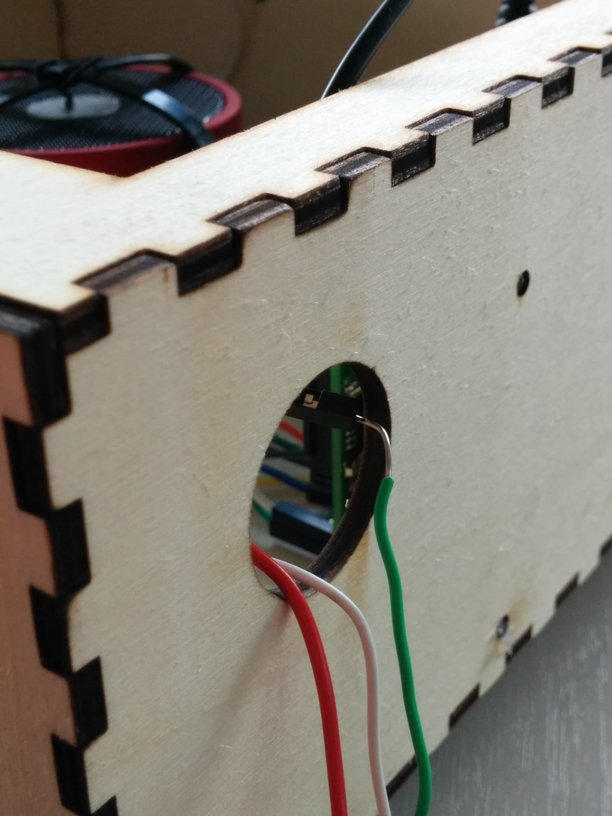
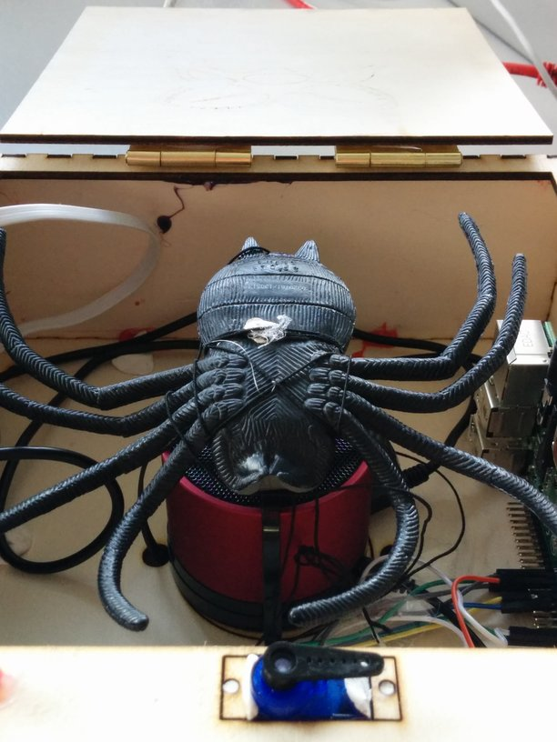

## Assembly

Now you'll need to mount all of your electronics in your box. As the Pi is the brains of the entire operation you'll need to mount that first. You can see a laser engraved outline for where the Pi should sit, located on the right hand side of the inside of the box. This is optimised for the Raspberry Pi B+ as there are four mounting holes. As you can see from the picture below, we used 3D printed spacers and M2.5 screws to fasten our Pi in the enclosure; however, you could quite easily screw it straight onto the side.

Now with the Pi attached to your box, you should put the speaker in the middle (where the laser cut outline is) and secure it in place with two cable ties like so:

Then with the speaker and Pi mounted, we can fix our servo in place. There are laser cut spaces for screw holes; however we just used Sugru to bodge it into place. The servo horn is going to be useful for holding the lid in place. Take a look at this image as a guide:

When attaching things like servos be careful! You don't want to move any wires by accident!

Now you should thread your power supply and button's wires through the opening that is on the enclosure (see image). If you don't do this then everything will be trapped in the box!   
Note only the 2 wires coming from the button are needed (we had a third for some other testing).

Now you'll have to attach your elastic thread to your spider. We used a little bit of hot glue to do this, but you could use an alternative such as Sugru or Super Glue.

Finally, attach the other end of the elastic thread to your box and place the spider upside down inside it like so:

Now close the lid and put the servo in place using its servo horn. We're ready to start coding!

